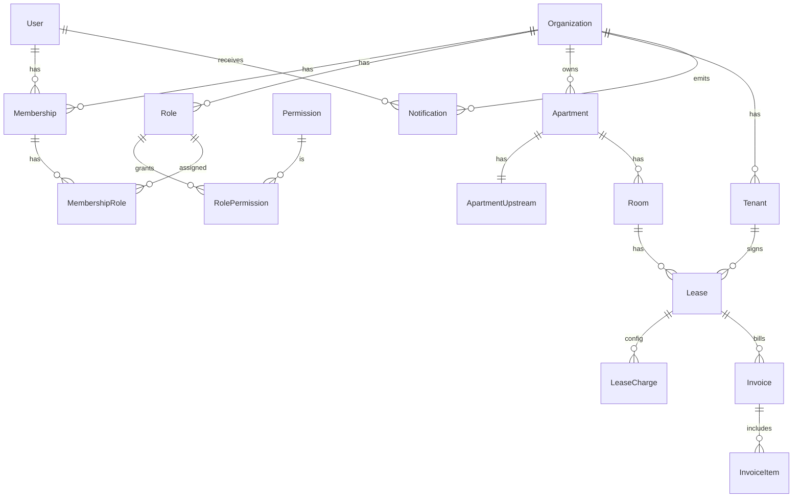

# 公寓管理系统（React + Express）实现方案

## 目标与范围（MVP优先）

- **前后端分离**：`apps/web`（React）+ `apps/api`（Express）。
- **多租户（组织）**：所有业务数据都按 `organizationId` 隔离；用户可加入多个组织并切换。
- **权限模型**：组织内 RBAC（角色-权限-成员多角色），初始内置 `Admin` 角色；支持自定义角色与权限配置。
- **公寓业务**：公寓/房间/价格/租客/租约/杂费配置。
- **自动出账与通知**：按租约周期自动生成账单（Invoice）并向具备权限的管理人员发送**站内通知**。
- **看板**：空房、到期提醒、基础运营指标（入住率、应收/已收/逾期）。

> 已确认：**登录方式=手机号+密码**；**通知渠道=站内通知**（邀请功能通过“邀请码/链接”由管理员线下转发）。

## 推荐“主流/流行”技术栈（2026 仍然主流的组合）

- **前端**：React + TypeScript + Vite、React Router、Ant Design、TanStack Query（请求/缓存）、Zustand（轻状态）、ECharts（看板）、Day.js。
- **后端**：Node.js LTS、Express + TypeScript、Prisma（ORM）+ PostgreSQL、Zod（校验/DTO）、JWT（access/refresh）、Swagger(OpenAPI)、Pino（日志）、Helmet/CORS。
- **任务与通知**：Redis + BullMQ（定时/队列），落地“自动出账/提醒”。
- **工程化**：pnpm workspaces + Turborepo、ESLint/Prettier、后端集成测试（Vitest/Jest + Supertest）。

## 代码组织（单仓库 Monorepo）

- `[apps/api](apps/api)`：Express 服务
  - `[apps/api/src/app.ts](apps/api/src/app.ts)`：Express 初始化（middleware、router）
  - `[apps/api/src/modules](apps/api/src/modules)`：按域拆分（auth/org/apartment/lease/billing/dashboard）
  - `[apps/api/prisma/schema.prisma](apps/api/prisma/schema.prisma)`：数据模型与迁移
  - `[apps/api/src/jobs](apps/api/src/jobs)`：BullMQ 定时任务（出账、到期提醒）
- `[apps/web](apps/web)`：React 管理后台
  - `[apps/web/src/routes](apps/web/src/routes)`：路由与页面
  - `[apps/web/src/features](apps/web/src/features)`：按域拆分（org/apartment/lease/billing/dashboard）
  - `[apps/web/src/api](apps/web/src/api)`：API client + hooks
- `[packages/shared](packages/shared)`：共享类型/Schema（Zod），用于前后端一致的 DTO/枚举（可选但强烈推荐）

## 核心数据模型（ER 概览）

### 关键实体与字段建议

- **User**：`phone` 唯一；`passwordHash`（argon2/bcrypt）；`displayName`。
- **Organization**：组织基础信息。
- **Membership**：用户加入组织的关系；支持 `status`（ACTIVE/PENDING）。
- **Role / Permission**：权限 key 采用字符串（例如 `apartment.read`, `apartment.upstream.write`, `billing.manage`）。
- **Apartment**：基础信息（地址、楼层、面积等）。
- **ApartmentUpstream**：上游成本信息（转让费、装修费押金等）与**独立权限**。
- **Room**：房间户型、面积、设施（JSON 或明细表）。
- **Tenant**：租客姓名、手机号、身份证号（注意脱敏显示）。
- **Lease**：租期、押金、租金规则（含递增）、到期日、状态。
- **LeaseCharge**：杂费配置（固定/抄表），可按月/周期计费。
- **Invoice / InvoiceItem**：账单与明细；抄表项支持 `PENDING_READING`。
- **Notification**：站内通知，目标用户为具备相关权限的成员（如 `billing.manage`）。

## 权限设计（RBAC + 资源隔离）

- **组织隔离**：所有 API 路由采用 `/orgs/:orgId/...`，统一中间件校验“是否成员”。
- **权限校验**：`requirePermission(permissionKey)` 中间件；管理员可配置角色-权限映射。
- **上游信息**：单独权限（例如 `apartment.upstream.read/write`），对应单独 API 与前端 Tab。

## 后端 API 边界（REST，重点端点）

- **认证**：
  - `POST /auth/register`（手机号+密码）
  - `POST /auth/login`
  - `POST /auth/refresh`（httpOnly cookie refreshToken，或 DB 存储 refresh token）
- **组织**：
  - `POST /orgs` 创建组织（自动创建 Admin 角色并赋予全部权限）
  - `GET /orgs` 列出我加入的组织
  - `POST /orgs/:orgId/invites` 生成邀请码/链接
  - `POST /orgs/:orgId/invites/accept` 通过邀请码加入
  - `GET/POST /orgs/:orgId/roles` 角色管理
  - `GET/PUT /orgs/:orgId/roles/:roleId/permissions` 权限配置
  - `GET/PUT /orgs/:orgId/members/:memberId/roles` 成员角色分配
- **公寓/房间**：
  - `GET/POST /orgs/:orgId/apartments`
  - `GET/PUT /orgs/:orgId/apartments/:apartmentId`
  - `GET/PUT /orgs/:orgId/apartments/:apartmentId/upstream`（需要 upstream 权限）
  - `GET/POST /orgs/:orgId/apartments/:apartmentId/rooms`
  - `GET/PUT /orgs/:orgId/rooms/:roomId`
  - `GET/PUT /orgs/:orgId/rooms/:roomId/pricing-plans`
- **租客/租约**：
  - `GET/POST /orgs/:orgId/tenants`
  - `GET/POST /orgs/:orgId/leases`（创建租约=绑定房间+租客+租期+押金+费用）
  - `GET/PUT /orgs/:orgId/leases/:leaseId`
- **出账/账单**：
  - `GET /orgs/:orgId/invoices`（筛选周期/状态）
  - `POST /orgs/:orgId/invoices/:invoiceId/items/:itemId/confirm-reading`（抄表后确认金额）
- **看板**：
  - `GET /orgs/:orgId/dashboard/vacant-rooms`
  - `GET /orgs/:orgId/dashboard/lease-expiring`
  - `GET /orgs/:orgId/dashboard/kpis`（入住率、应收、逾期等）

## 自动出账与租金递增（实现要点）

- **租金递增规则（建议 MVP）**：租约保存 `baseRent` + `increaseType(fixed|percent)` + `increaseValue` + `increaseIntervalMonths`。
- **计算方式**：对目标账期起始日，计算自租约起始日的整月差 `m`，递增次数 `k=floor(m/increaseIntervalMonths)`，
  - fixed：`rent = baseRent + k*increaseValue`
  - percent：`rent = baseRent*(1+increaseValue)^k`
- **抄表费用**：生成账单时创建 `PENDING_READING` 明细；录入读数后结算金额并更新账单总额。
- **调度**：BullMQ 每日/每小时扫描“即将到期/需要出账”的租约，生成账单并写入 Notification。

## 前端页面与交互（Admin 面板风格）

- **全局**：登录页、组织切换器、权限控制（无权限隐藏/禁用入口）。
- **组织与权限**：成员列表、邀请、角色列表、权限勾选、成员分配角色。
- **公寓**：公寓列表/详情、房间列表、房间设施与价格方案。
- **租客/租约**：租客 CRUD、创建租约（选择房间、租客、租期、押金、租金递增、杂费）。
- **账单**：账单列表、账单详情、抄表录入与确认。
- **看板**：空房、到期提醒、基础 KPI 图表。

## 非功能性要求（落地必备）

- **安全**：密码哈希（argon2/bcrypt）、JWT、CORS 白名单、速率限制、输入校验（Zod）。
- **审计**（建议）：关键操作（角色权限变更、创建租约、出账）写 `AuditLog`，便于追溯。
- **可观测性**：结构化日志（pino）、请求追踪 ID。

## 交付策略

- **第一阶段（可用 MVP）**：组织/权限、基础公寓与房间、租客与租约、月度固定费用、手动触发出账、站内通知、空房/到期列表。
- **第二阶段（自动化+分析）**：BullMQ 自动出账、抄表流程、逾期/催缴、KPI 图表。
- **第三阶段（增强）**：更复杂的租金梯度表、费用模板（按公寓/房型复用）、导出报表、更多图表维度。

