# 公寓管理系统 - 业务流程图

## 目录
1. [系统整体架构](#系统整体架构)
2. [用户与组织管理流程](#用户与组织管理流程)
3. [公寓与房间管理流程](#公寓与房间管理流程)
4. [签约流程](#签约流程)
5. [账单生成与管理流程](#账单生成与管理流程)
6. [租约管理流程](#租约管理流程)
7. [核心业务实体关系](#核心业务实体关系)

---

## 系统整体架构

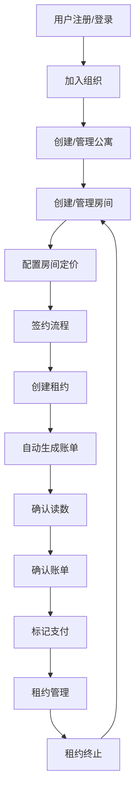

---

## 用户与组织管理流程

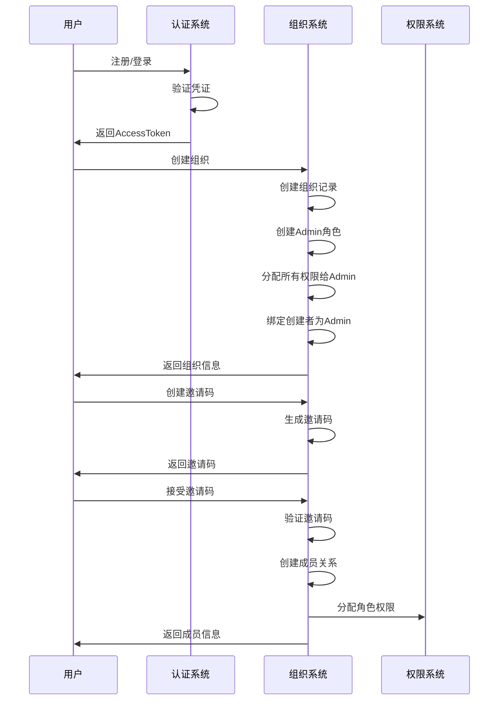

---

## 公寓与房间管理流程

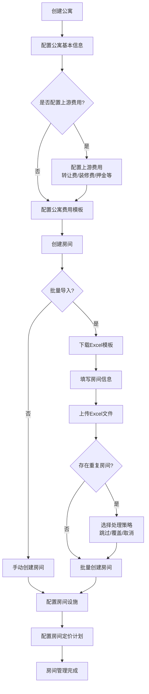

### 房间状态管理

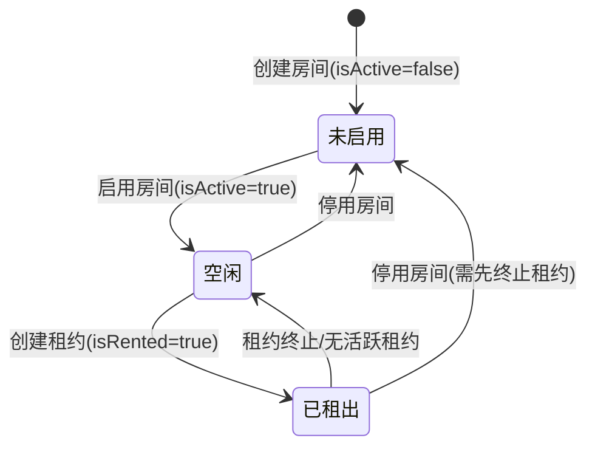

---

## 签约流程

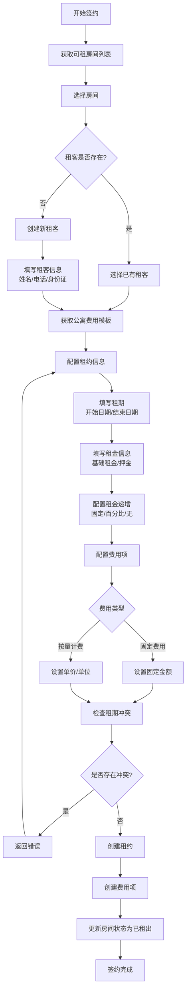

### 签约事务处理

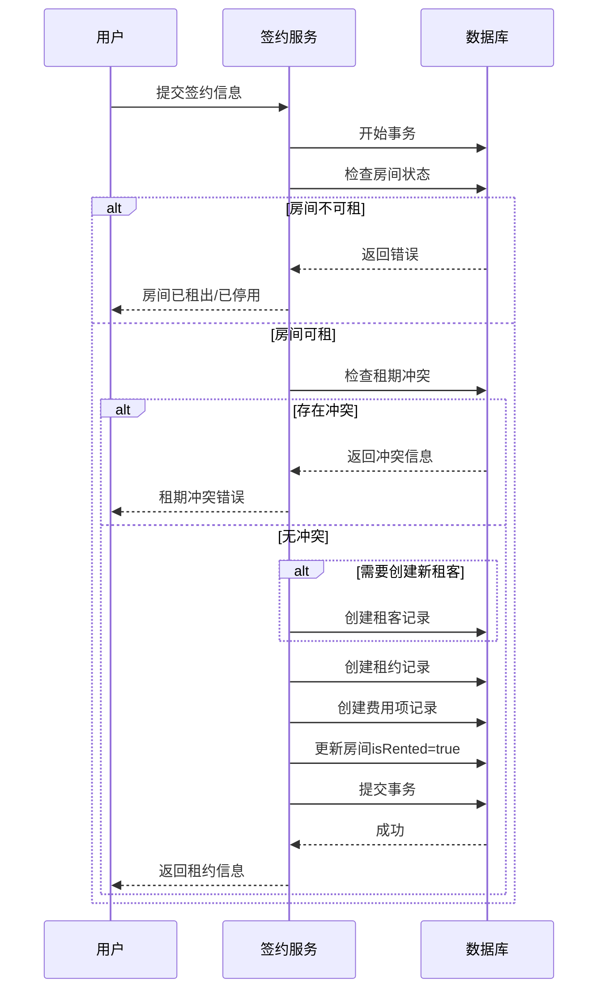

---

## 账单生成与管理流程

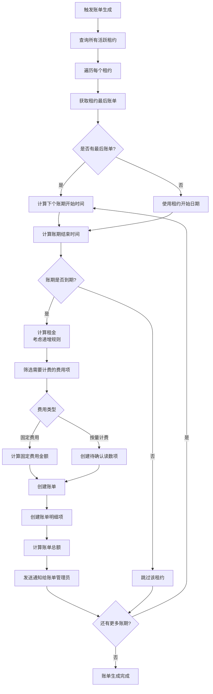

### 账单确认与支付流程

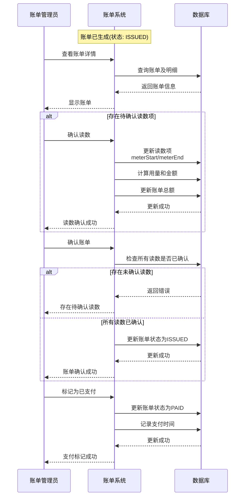

### 账单状态流转

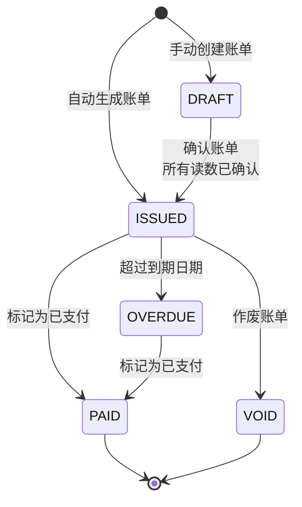

### 账单明细项状态

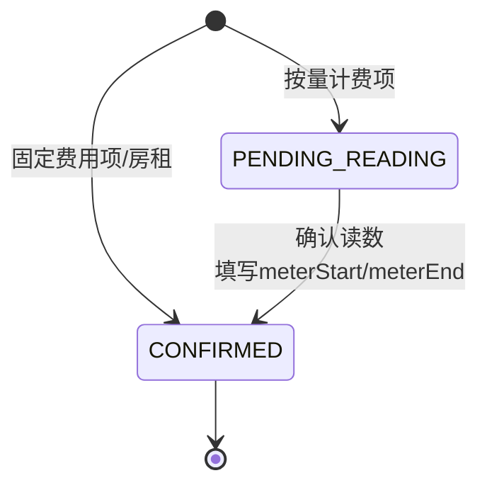

---

## 租约管理流程

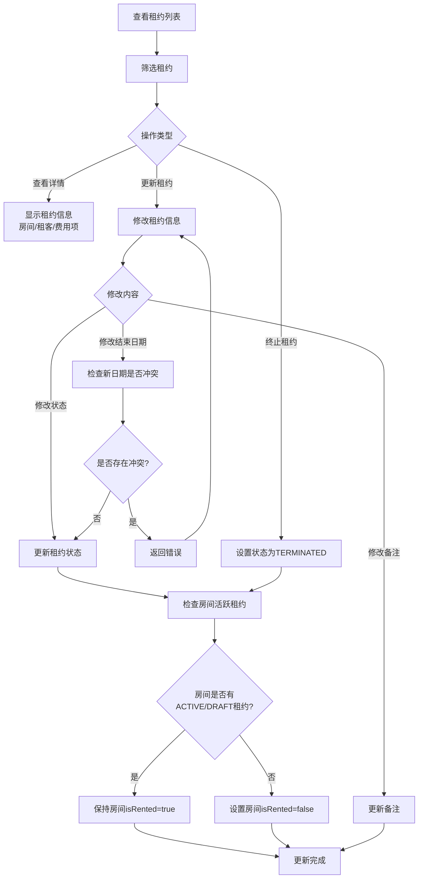

### 租约状态流转

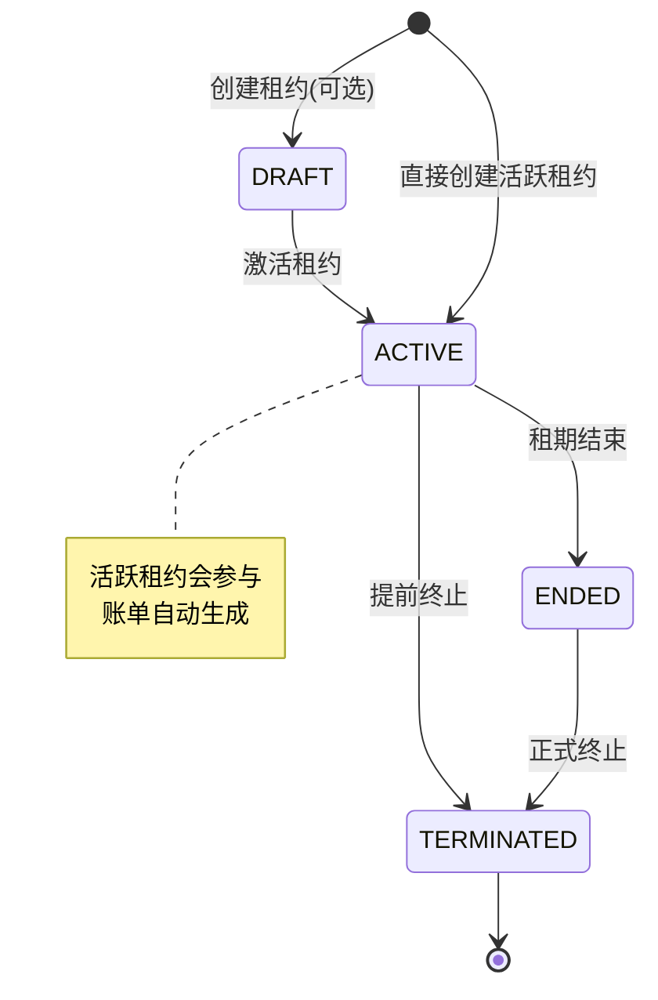

---

## 核心业务实体关系

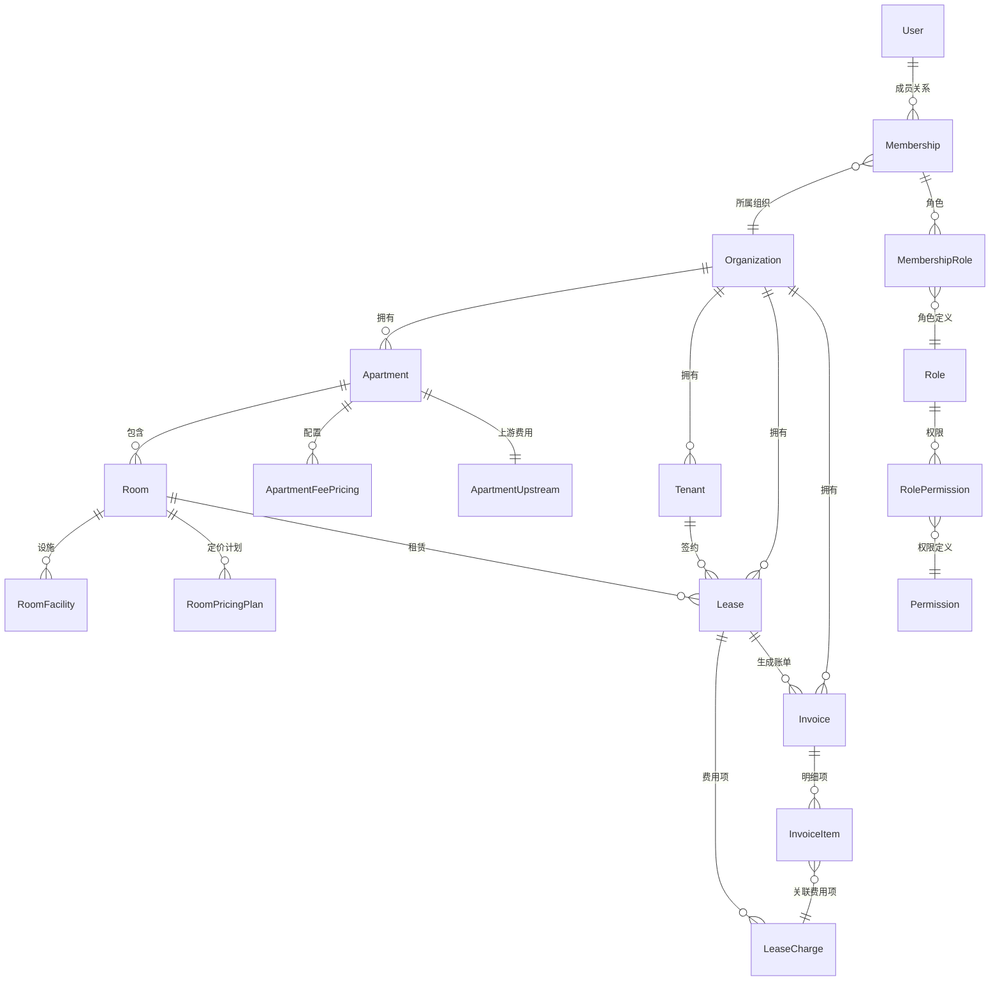

---

## 关键业务规则说明

### 1. 租约冲突检查
- 只有**未终止(非TERMINATED状态)**的租约才会阻止创建新租约
- 检查条件：`startDate < newEndDate AND endDate > newStartDate`
- 已终止的租约不影响新租约创建

### 2. 房间状态同步
- 创建租约时：自动设置 `room.isRented = true`
- 更新租约时：根据房间是否存在 `ACTIVE` 或 `DRAFT` 租约自动同步 `isRented` 状态
- 如果房间没有任何活跃租约，则 `isRented = false`

### 3. 账单生成规则
- 只对 `ACTIVE` 状态的租约生成账单
- 从租约开始日期或最后账单的结束日期开始计算
- 最多追赶24个账期，避免无限循环
- 账单账期 = `billingCycleMonths`（默认1个月）

### 4. 租金递增计算
- **NONE**: 不递增，始终使用基础租金
- **FIXED**: 每 `rentIncreaseIntervalMonths` 个月增加固定金额 `rentIncreaseValue`
- **PERCENT**: 每 `rentIncreaseIntervalMonths` 个月按百分比递增 `rentIncreaseValue%`

### 5. 费用计费规则
- **固定费用(FIXED)**: 直接使用 `fixedAmountCents`
- **按量计费(METERED)**: 需要确认读数，计算 `(meterEnd - meterStart) * unitPriceCents`
- **计费周期**: 根据 `billingCycleMonths` 决定是否在当期计费
- **计费时机**: 
  - 水电费默认后付(POSTPAID)，账期是上个月
  - 其他费用默认预付(PREPAID)，账期是下个月

### 6. 账单确认流程
- 账单生成时，按量计费项状态为 `PENDING_READING`
- 必须先确认所有待确认读数项，才能确认账单
- 确认读数时自动计算金额并更新账单总额
- 账单确认后状态从 `DRAFT` 变为 `ISSUED`

### 7. 通知机制
- 账单生成时，自动通知有 `billing.manage` 权限的成员
- 通知类型：`INVOICE_CREATED`
- 通知包含账单账期和账单ID

---

## 数据流转示例

### 完整业务流程示例

```
1. 用户注册 → 创建组织 → 获得Admin权限
2. 创建公寓 → 配置费用模板(水费/电费/物业费等)
3. 创建房间 → 配置房间设施 → 配置定价计划
4. 签约流程：
   - 选择房间(自动过滤已租出房间)
   - 创建/选择租客
   - 配置租约信息(租期/租金/费用项)
   - 系统检查租期冲突
   - 创建租约 → 房间状态变为已租出
5. 账单生成(定时任务或手动触发)：
   - 查询所有ACTIVE租约
   - 计算每个租约的下个账期
   - 生成账单(房租+固定费用+待确认读数项)
   - 发送通知给账单管理员
6. 账单管理：
   - 查看账单列表
   - 确认按量计费项的读数
   - 确认账单(所有读数已确认)
   - 标记为已支付
7. 租约管理：
   - 查看租约详情
   - 更新租约信息(结束日期/状态/备注)
   - 终止租约 → 房间状态自动更新
```

---

## 权限控制说明

系统采用基于角色的访问控制(RBAC)：

- **组织级别**: 用户必须属于组织才能访问组织资源
- **权限级别**: 每个操作需要特定权限，如：
  - `apartment.read/write`: 公寓管理
  - `room.read/write`: 房间管理
  - `lease.read/write`: 租约管理
  - `billing.read/manage`: 账单管理
  - `tenant.read/write`: 租客管理
  - `org.manage/role.manage/member.manage`: 组织管理

- **系统角色**: Admin角色自动拥有所有权限，且不能移除 `org.manage` 和 `org.role.manage` 权限

---

*文档生成时间: 2025-02-04*
*系统版本: 基于 Prisma + Express + TypeScript*
